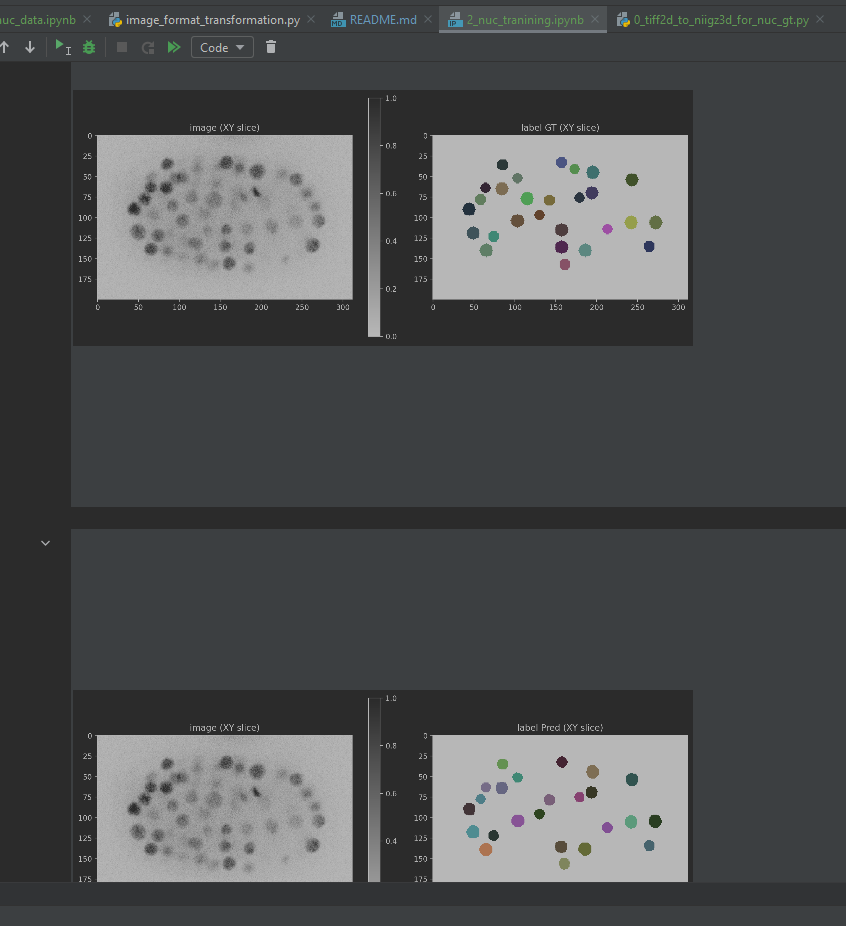
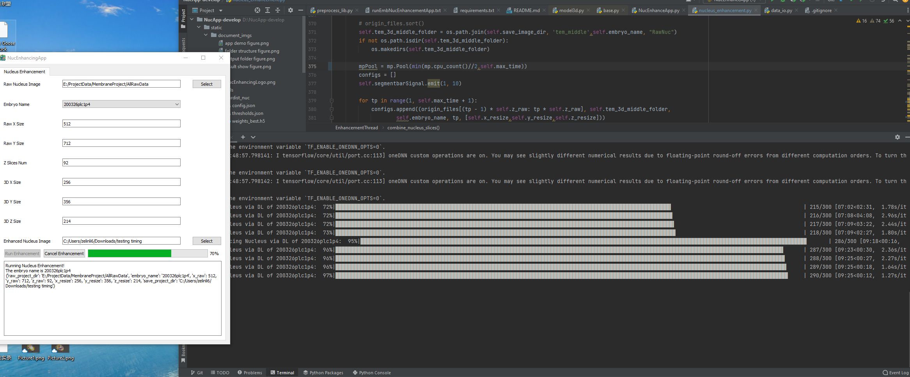

# DELICATE: NucEnhancedApp Enhance the Nucleus Images in live-cell embryos via Effective Deep Learning Model

## 1. Programme Introduction

This is a programme for running the fluorescence images of cell nucleus enhancement, especially for *C. elegans*. For other animals, you need to re-train the DNN model with about 4 embryos Ground Truth.

## 2. Running Steps

Make sure you have installed python3 (https://www.python.org/downloads/) and conda (https://docs.anaconda.com/free/miniconda/index.html) in your computer linux/osx/windows.

Then run the following command one by one in your terminal/command line/power shell.

**The first time**
* conda create --name EmbNucEnhancementPYEnvironment20240329Ver python=3.9.19
* conda activate EmbNucEnhancementPYEnvironment20240329Ver
* pip install PyQt5
* pip install stardist
* pip install nibabel
* pip install tensorflow
* python NucEnhanceApp.py

**Second and future**
* conda activate EmbNucEnhancementPYEnvironment20240329Ver
* python NucEnhanceApp.py
* group the correct raw nucleus tif images folder !

Then you get the 

Configure the parameters according to your images and choose recommended Zhaolab model 

### **CAUTIONS!**
* You need at least **16GiB** physical or swap memory free to run our DEEP LEARNING enhancing model!! Close other memory-consuming programs!
* Make sure your images are cropped, which means there is **only one** embryo in the time series images.
* The 3D X Y Z size should be tuned to range 150-300, 250-400, 120-250, respectively, and keep the resolution correct.
* You may need to train your model with your own cropped data (1 embryo) or contact me (zelinli6-c(at)my.cityu.edu.hk). The training processes are provides as followed. I will help you in training your own model for your lab (specific protein or microscopic).
  
*Close the terminal directly*

## 3. Result comparison
The output folder looks like:

The programme would enhance all recognized nucleus images and allow starrynite and acetree to trace the whole live-cell lineage .

The enhanced performance would increase as the cell number increase (The messier the image, the better enhancement).

## 4. Training With Your Data

### 4.1 Prepare the groundtruth

Please configure file **0_tiff2d_to_niigz3d_for_nuc_gt.py** to packed the 2D tif to 3D niigz according to the naming system. Now, you have transformed your images and CDfiles to a niigz groundtruth (Like file **GroundTruthTrainingDataset3EmbDuLab.zip** on https://doi.org/10.6084/m9.figshare.26778475.v1)

### 4.2 Prepare training data

Please read and run jupyter notebook file **1_nuc_data.ipynb** step by step to ensure the groundtruth training dataset is ready (Like file **GroundTruthTrainingDataset6EmbZhaoLab.zip** on https://doi.org/10.6084/m9.figshare.26778475.v1). You can view the GT here.

### 4.3 Training

Run jupyter **notebook 2_nuc_training.ipynb**. The trained model is placed at ./Training/models/stardist_nuc. 

### 4.4 Move your model for running

Create a new folder under ./static/models/ with the name you want. Move config.json, weights_best.h5, and thresholds.json in ./Training/models/stardist_nuc to your new created folder. Now you can select your model when running.

## 5. Issues/Notes

* **Please make sure your computer has at least 16GiB memory**.

* **The progress bar reflect not real progress. Actually, it takes about 1 hour (good cpu) to enhance a 300 time point >550-cell embryo. Please consider the real progress in the terminal or check the output folder.**
* 

* **The programme is running with only CPU and need no GPU**.
